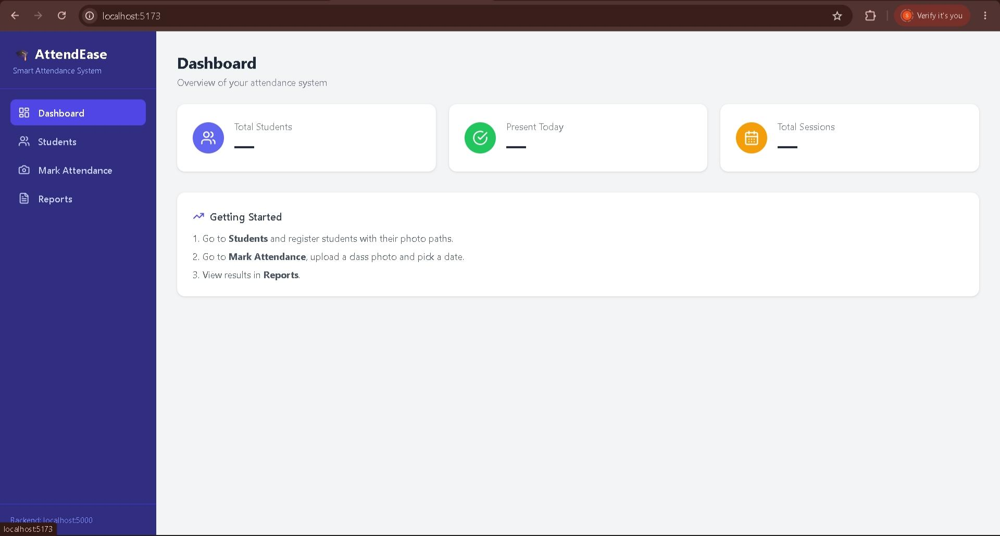
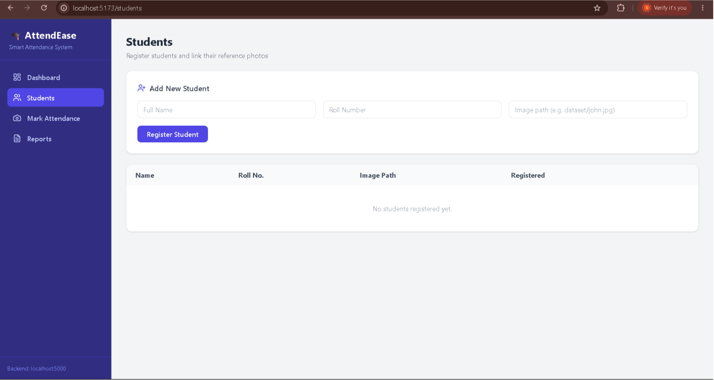
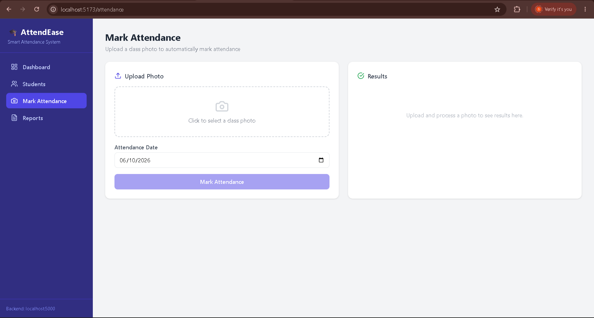
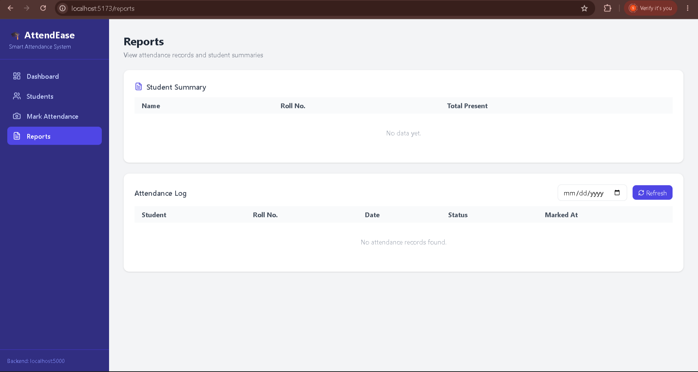

# 🎓 Smart Attendance System

An AI-powered Smart Attendance System that automates attendance management using facial recognition, computer vision, and a modern web dashboard.

## 🌐 Live Demo

**Frontend:** https://smart-attendance-system-six-sigma.vercel.app/

**Backend API:** https://industrious-heart-production-5a4e.up.railway.app/

---

## 📸 Screenshots

Add screenshots inside the `screenshots/` folder and update the paths below.

### Dashboard



### Student Management



### Attendance Marking



### Reports



---

## 🚀 Features

* Student Registration & Management
* Attendance Tracking
* Attendance Reports & Analytics
* Dashboard Statistics
* Face Recognition-Based Attendance
* RESTful Flask API
* Responsive React Frontend
* SQLite Database Integration
* CORS Enabled Backend
* Cloud Deployment Support

---

## 🛠️ Tech Stack

### Frontend

* React.js
* Vite
* JavaScript
* CSS

### Backend

* Flask
* Flask-SQLAlchemy
* Flask-CORS

### Computer Vision

* OpenCV
* face_recognition
* dlib

### Database

* SQLite

### Deployment

* Vercel (Frontend)
* Railway (Backend)

---

## 📂 Project Structure

```text
smart-attendance-system/
│
├── frontend/
│   ├── src/
│   ├── public/
│   └── package.json
│
├── backend/
│   ├── app.py
│   ├── face_utils.py
│   ├── attendance.db
│   ├── requirements.txt
│   └── dataset/
│
├── screenshots/
│
└── README.md
```

---

## ⚙️ Local Setup

### Clone Repository

```bash
git clone https://github.com/SanjayPhilip/smart-attendance-system.git
cd smart-attendance-system
```

---

### Backend Setup

```bash
cd backend

pip install -r requirements.txt

python app.py
```

Backend runs on:

```text
http://localhost:5000
```

---

### Frontend Setup

```bash
cd frontend

npm install

npm run dev
```

Frontend runs on:

```text
http://localhost:5173
```

---

## API Endpoints

### Students

```http
GET /students
POST /students
DELETE /students/<id>
```

### Attendance

```http
POST /attendance/mark
GET /attendance
GET /attendance/report
```

### Dashboard

```http
GET /dashboard/stats
```

---

## Deployment Notes

The cloud deployment runs in a compatibility mode due to platform limitations with graphical dependencies required by dlib/OpenCV.

Face recognition functionality is fully supported in local deployment environments.

---

## Resume Highlights

* Developed a full-stack attendance management platform using React and Flask.
* Built REST APIs for student and attendance management.
* Implemented attendance analytics and reporting features.
* Integrated computer vision and facial recognition technologies.
* Deployed production-ready frontend and backend services using Vercel and Railway.

---

## Future Improvements

* Admin Authentication
* Role-Based Access Control
* Cloud Database (PostgreSQL)
* Excel/CSV Export
* Mobile Responsive UI Enhancements
* Real-Time Webcam Attendance
* Dark Mode
* Advanced Analytics Dashboard

---

## Author

### Sanjay Philip

Full-Stack Developer • Machine Learning Enthusiast

* GitHub: https://github.com/SanjayPhilip
* LinkedIn: Add your LinkedIn URL here

⭐ If you found this project useful, consider giving it a star.
